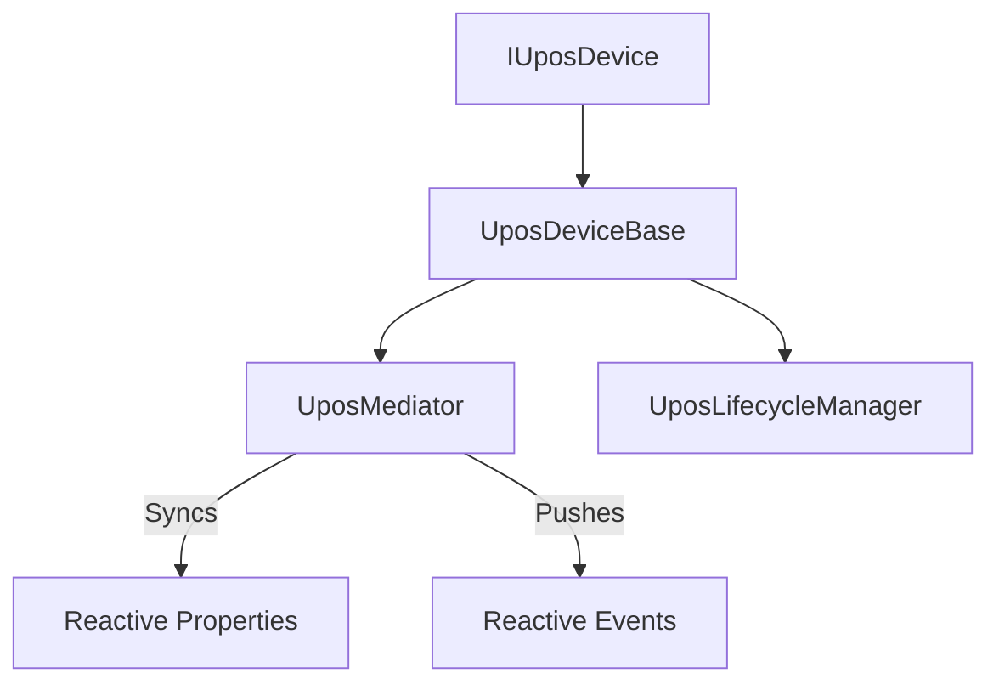

# PosSharp (日本語)

[](https://opensource.org/licenses/MIT)
[](https://dotnet.microsoft.com/download)

**PosSharp** は、プラットフォーム非依存でリアクティブな .NET 用 UPOS (Unified POS) フレームワークです。レガシーな POS for .NET (OPOS) 等のプラットフォーム固有 SDK 依存からコアロジックを切り離し、現代的な C# 実装を提供します。

## 🚀 主な特徴

- **プラットフォーム非依存のコア**: `.net10.0` をターゲットとし、[PolySharp](https://github.com/Sergio0694/PolySharp) を通じて下位互換性も確保。コアライブラリに Windows 固有の SDK 依存はなく、将来的には他の .NET バージョンも広くサポート予定です。
- **リアクティブな状態管理**: [R3](https://github.com/Cysharp/R3) を活用した状態同期。`State`, `PowerState`, `ResultCode` などのプロパティを Reactive Observable として公開。
- **Mediator パターンの採用**: **Mediator パターン** による「単一の真実（Single Source of Truth）」管理。`DataCount` や `IsOpen` 等の全プロパティの整合性を自動で担保。
- **現代的なライフサイクル**: Task ベースの非同期 API (`OpenAsync`, `ClaimAsync`, `SetEnabledAsync`) を標準装備。
- **電源管理 (Power Management)**: 電源状態の監視や標準イベント通知 (`PowerNotify`) のサポートを基底クラスに統合。
- **高いテスト容易性**: スタブの作成や明示的な状態検証の無効化など、テスト駆動開発 (TDD) を強力にサポート。

## 🏗️ アーキテクチャ

PosSharp は、UPOS 規格の複雑さを整理し、保守性の高いコードを維持するために洗練されたアーキテクチャを採用しています。

### Mediator による状態管理
各デバイスは、状態とプロパティの管理を `UposMediator` に委譲します。これにより、デバイスの状態（例: `Idle` から `Enabled` へ）が遷移した際、関連するプロパティや Reactive ストリームがアトミックに更新されることを保証します。

### 柔軟なライフサイクル管理
デバイスの遷移ルールは `UposLifecycleManager` によって制御されます。開発者はカスタムのライフサイクルハンドラーを実装することも、標準的な `StandardLifecycleHandler` をそのまま利用することも可能です。

### 責務の分離 (Responsibility Separation)
PosSharp は「フレームワークとしての枠組み」と「具体的なデバイス実装」の責務を厳格に分離しています。
- **フレームワーク側 (PosSharp.Core)**: UPOS に準拠したテンプレート、状態遷移ルール、および電源管理の自動通知機能を提供します。
- **デバイス実装側**: 基底クラスを継承し、実際のハードウェア制御やシミュレーションロジック、およびデバイス固有のメンバーを実装します。



## 🛠️ 使い方

新しい UPOS デバイスを作成するには、`UposDeviceBase` を継承します：

```csharp
// 自動釣銭機 (CashChanger) の実装例
public class MyCashChanger : UposDeviceBase
{
    public MyCashChanger() : base() { }

    // 必須の抽象メソッドをオーバーライド
    protected override Task OnOpenAsync(CancellationToken ct) => Task.CompletedTask;
    protected override Task OnClaimAsync(int timeout, CancellationToken ct) => Task.CompletedTask;
    protected override Task OnSetEnabledAsync(bool enabled, CancellationToken ct) => Task.CompletedTask;
    
    public override Task<UposCommandResult> CheckHealthAsync(HealthCheckLevel level)
    {
        return Task.FromResult(new UposCommandResult(UposErrorCode.Success));
    }
    
    // ヘルパメソッドを使用して内部状態を更新
    public void SimulateCashAdded()
    {
        // DataCount などのプロパティは Mediator を通じて自動同期されます
        UpdateDataCount(DataCount + 1);
    }
}
```

## 🧪 テスト

PosSharp は **Shouldly** と **xUnit** を使用した包括的なテストスイートを備えています。

```bash
dotnet test
```

UPOS の共通プロパティの初期値検証や、電源管理の連動ロジックが規格どおりに動作するかを確認するテストが含まれています。

## 📄 ライセンス

本プロジェクトは **MIT ライセンス** の下で公開されています。詳細は [LICENSE](LICENSE) ファイルを参照してください。
