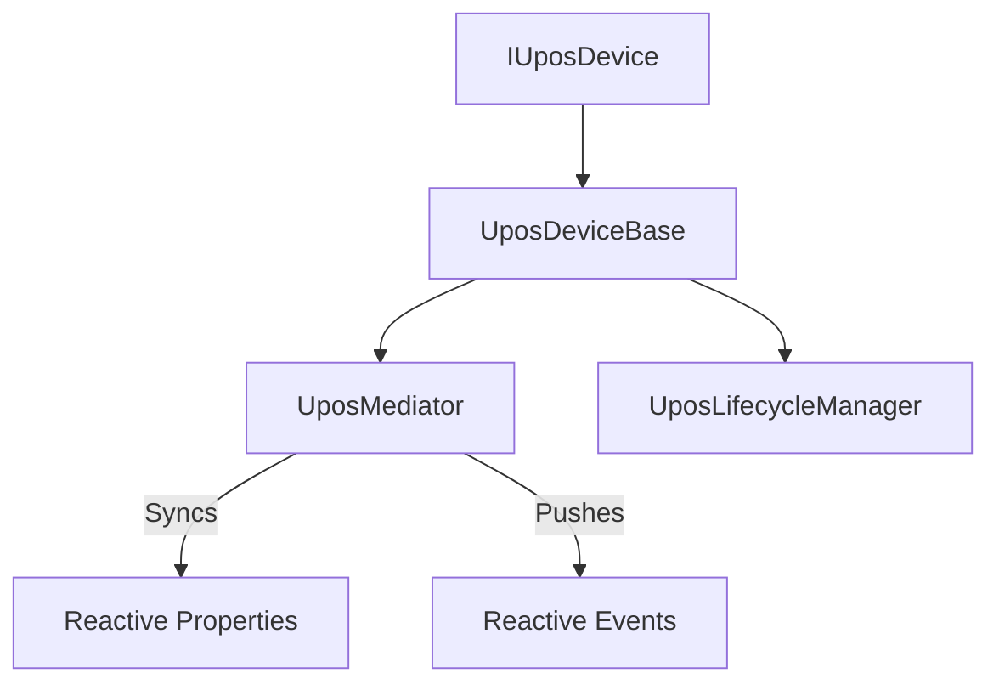

# PosSharp (日本語)

[](https://opensource.org/licenses/MIT)
[](https://dotnet.microsoft.com/download)
[](https://www.nuget.org/packages/PosSharp.Core/)
[](https://www.nuget.org/packages/PosSharp.Abstractions/)
[](https://github.com/w-red/PosSharp/actions/workflows/ci.yml)

**PosSharp** は、プラットフォーム非依存でリアクティブな .NET 用 UPOS (Unified POS) フレームワークです。レガシーな POS for .NET (OPOS) 等のプラットフォーム固有 SDK や Windows 固有コンポーネントからコアロジックを切り離し、現代的な C# 実装を提供します。

## 🚀 主な特徴

- **現代的な C# 実装**: C# 12+ の機能（Primary Constructors 等）をフル活用し、`.net10.0` をターゲットに構築。[PolySharp](https://github.com/Sergio0694/PolySharp) を通じて幅広いプラットフォームをサポート。
- **リアクティブな状態管理**: [R3](https://github.com/Cysharp/R3) を活用した状態同期。`State`, `PowerState`, `ResultCode` などのプロパティを Reactive Observable として公開。
- **Mediator パターンの採用**: **Mediator パターン** による「単一の真実（Single Source of Truth）」管理。非同期操作を跨いでも `DataCount` や `IsOpen` 等の全プロパティが完璧に同期。
- **Task ベースの非同期 API**: 標準的な UPOS 操作（`OpenAsync`, `ClaimAsync`, `SetEnabledAsync`）を現代的な非同期 API として実装。
- **包括的な電源管理**: 電源状態の監視や標準イベント通知（`PowerNotify`）のサポートを基底抽象クラスに直接統合。
- **警告ゼロの品質**: 100% の XML ドキュメントコメントと厳格な静的解析を維持し、最高水準のコード品質を担保。

## 📦 パッケージ

| パッケージ | 説明 |
| ---------- | ---- |
| **PosSharp.Abstractions** | インターフェース、列挙型、イベントレコード。クライアント側の依存関係に最適。 |
| **PosSharp.Core** | フレームワーク本体。基底クラス、ライフサイクル管理、リアクティブメディエーターを含む。 |

### インストール

```bash
# デバイスを実装する場合
dotnet add package PosSharp.Core

# 純粋な抽象定義のみが必要な場合
dotnet add package PosSharp.Abstractions
```

## 🏗️ アーキテクチャ

PosSharp は、UPOS 規格の複雑さを整理し、保守性の高いコードを維持するために洗練されたアーキテクチャを採用しています。

### Mediator による状態管理
各デバイスは、状態とプロパティの管理を `UposMediator` に委譲します。これにより、デバイスの状態（例: `Idle` から `Enabled` へ）が遷移した際、関連するプロパティや Reactive ストリームがアトミックに更新されることを保証します。

### 柔軟なライフサイクル管理
デバイスの遷移ルールは `UposLifecycleManager` によって制御されます。開発者はカスタムのライフサイクルハンドラーを実装することも、標準的な `StandardLifecycleHandler` をそのまま利用することも可能です。



## 🛠️ 使い方

新しい UPOS デバイスを作成するには、`UposDeviceBase` を継承します：

```csharp
using PosSharp.Abstractions;
using PosSharp.Core;

// 自動釣銭機 (CashChanger) の実装例
public class MyCashChanger : UposDeviceBase
{
    // 必須の抽象メソッドをオーバーライド
    protected override Task OnOpenAsync(CancellationToken ct) => Task.CompletedTask;
    protected override Task OnCloseAsync(CancellationToken ct) => Task.CompletedTask;
    protected override Task OnClaimAsync(int timeout, CancellationToken ct) => Task.CompletedTask;
    protected override Task OnReleaseAsync(CancellationToken ct) => Task.CompletedTask;
    protected override Task OnEnableAsync(CancellationToken ct) => Task.CompletedTask;
    protected override Task OnDisableAsync(CancellationToken ct) => Task.CompletedTask;

    protected override Task<string> OnCheckHealthAsync(HealthCheckLevel level, CancellationToken ct)
    {
        return Task.FromResult("Internal:OK");
    }

    protected override Task OnDirectIOAsync(int command, int data, object obj, CancellationToken ct) => Task.CompletedTask;
    protected override Task OnClearInputAsync(CancellationToken ct) => Task.CompletedTask;
    protected override Task OnClearOutputAsync(CancellationToken ct) => Task.CompletedTask;
    
    // ヘルパメソッドを使用して内部状態を更新
    public void SimulateCashAdded()
    {
        // DataCount などのプロパティは Mediator を通じて自動同期されます
        UpdateDataCount(DataCount + 1);
    }
}
```

## 🧪 テスト

PosSharp は高いテスト容易性を備えています。包括的なテストスイートに加え、独自のデバイス実装の検証に役立つスタブ（Stub）も提供しています。

```bash
dotnet test
```

## 📄 ライセンス

本プロジェクトは **MIT ライセンス** の下で公開されています。詳細は [LICENSE](LICENSE) ファイルを参照してください。
