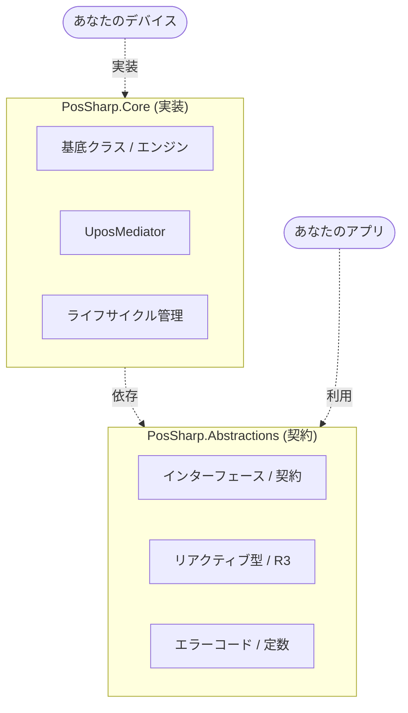
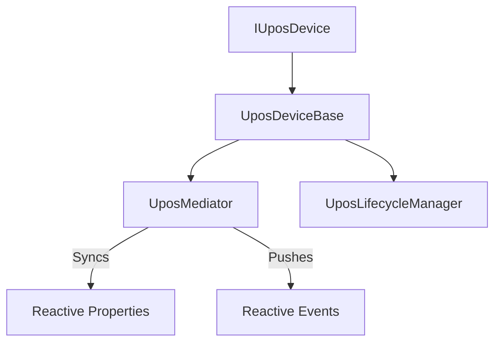

# PosSharp (日本語)

[日本語](README.jp.md) | [English](README.md)

---

[ドキュメント目次](docs/index.jp.md) | [API Reference (Wiki)](https://github.com/w-red/PosSharp/wiki)

[](https://opensource.org/licenses/MIT)
[](https://dotnet.microsoft.com/download)
[](https://www.nuget.org/packages/PosSharp.Core/)
[](https://www.nuget.org/packages/PosSharp.Abstractions/)
[](https://github.com/w-red/PosSharp/actions/workflows/ci.yml)
[](https://github.com/w-red/PosSharp/actions/workflows/release.yml)

**PosSharp** は、プラットフォーム非依存でリアクティブな .NET 用 UPOS (Unified POS) フレームワークです。レガシーな POS for .NET (OPOS) 等のプラットフォーム固有 SDK や Windows 固有コンポーネントからコアロジックを切り離し、現代的な C# 実装を提供します。

## 🚀 主な特徴

- **現代的な C# 実装**: C# 12+ の機能（Primary Constructors 等）をフル活用し、`.net10.0` をターゲットに構築。[PolySharp](https://github.com/Sergio0694/PolySharp) を通じて幅広いプラットフォームをサポート。
- **リアクティブな状態管理**: [R3](https://github.com/Cysharp/R3) を活用した状態同期。`State`, `PowerState`, `ResultCode` などのプロパティを Reactive Observable として公開。
- **Mediator パターンの採用**: **Mediator パターン** による「単一の真実（Single Source of Truth）」管理。非同期操作を跨いでも `DataCount` や `IsOpen` 等の全プロパティが完璧に同期。
- **Task ベースの非同期 API**: 標準的な UPOS 操作（`OpenAsync`, `ClaimAsync`, `SetEnabledAsync`）を現代的な非同期 API として実装。
- **包括的な電源管理**: 電源状態の監視や標準イベント通知（`PowerNotify`）のサポートを基底抽象クラスに直接統合。
- **ロックフリーなスレッドセーフティ**: `AtomicState<T>` による CAS (Compare-And-Swap) ベースのアトミックな状態管理。高並列環境に最適化されています。
- **警告ゼロの品質**: 100% の XML ドキュメントコメントと厳格な静的解析を維持し、最高水準のコード品質を担保。

## 📦 パッケージ

| パッケージ | 説明 |
| ---------- | ---- |
| **PosSharp.Abstractions** | インターフェース、列挙型、イベントレコード。アプリケーション側の依存関係に最適。 |
| **PosSharp.Core** | フレームワーク本体。基底クラス、ライフサイクル管理、リアクティブメディエーターを含む。 |

### インストール

```bash
# デバイスを実装する場合
dotnet add package PosSharp.Core

# 純粋な抽象定義のみが必要な場合
dotnet add package PosSharp.Abstractions
```

## 🏗️ アーキテクチャ

PosSharp は、高い柔軟性とテスト容易性を実現するために、明確にレイヤー化されたアーキテクチャを採用しています。

### パッケージ構成（概要）
アプリケーション側の依存関係を最小限に抑えるため、フレームワークは大きく 2 つのパッケージに分かれています：


```mermaid
graph TD
    subgraph Core ["PosSharp.Core (実装)"]
        CoreLogic[基底クラス / エンジン]
        MediatorImpl[UposMediator]
        LifecycleLogic[ライフサイクル管理]
    end

    subgraph Abstractions ["PosSharp.Abstractions (契約)"]
        Interfaces[インターフェース / 契約]
        Reactive[リアクティブ型 / R3]
        Enums[エラーコード / 定数]
    end

    %% 依存関係
    Core -.->|依存| Abstractions
    
    %% 利用パターン
    App([あなたのアプリ]) -.->|利用| Abstractions
    Dev([あなたのデバイス]) -.->|実装| Core
```

- **PosSharp.Abstractions**: 純粋な「契約（インターフェース）」と「型定義」を含みます。デバイスを利用する側のアプリケーションは、このパッケージのみに依存すれば十分です。
- **PosSharp.Core**: フレームワークの「エンジン」と「リファレンス実装」を含みます。新しいデバイスドライバやシミュレータを実装する場合にのみ必要となります。

### 内部コンポーネント構造
各デバイス実装は、スレッドセーフティとリアクティブな一貫性を担保するために、以下の内部パターンを組み合わせて動作します：


```mermaid
graph TD
    Device[IUposDevice] --> Base[UposDeviceBase]
    Base --> Mediator[UposMediator]
    Base --> Lifecycle[UposLifecycleManager]
    Mediator -- Syncs --> Props[Reactive Properties]
    Mediator -- Pushes --> Events[Reactive Events]
```

#### Mediator による状態管理
各デバイスは、状態とプロパティの管理を [`UposMediator`](https://github.com/w-red/PosSharp/wiki/PosSharp.Core.UposMediator) に委譲します。

## 🛠️ 使い方

新しい UPOS デバイスを作成するには、`UposDeviceBase` を継承します：

```csharp
using PosSharp.Abstractions;
using PosSharp.Core;

// 自動釣銭機 (CashChanger) の実装例
public class MyCashChanger : UposDeviceBase
{
    // 必須の抽象メソッドをオーバーライド
    protected override Task OnOpenAsync(CancellationToken ct) => Task.CompletedTask;
    protected override Task OnCloseAsync(CancellationToken ct) => Task.CompletedTask;
    protected override Task OnClaimAsync(int timeout, CancellationToken ct) => Task.CompletedTask;
    protected override Task OnReleaseAsync(CancellationToken ct) => Task.CompletedTask;
    protected override Task OnEnableAsync(CancellationToken ct) => Task.CompletedTask;
    protected override Task OnDisableAsync(CancellationToken ct) => Task.CompletedTask;

    protected override Task<string> OnCheckHealthAsync(HealthCheckLevel level, CancellationToken ct)
    {
        return Task.FromResult("Internal:OK");
    }

    protected override Task OnDirectIOAsync(int command, int data, object obj, CancellationToken ct) => Task.CompletedTask;
    protected override Task OnClearInputAsync(CancellationToken ct) => Task.CompletedTask;
    protected override Task OnClearOutputAsync(CancellationToken ct) => Task.CompletedTask;
    
    // ヘルパメソッドを使用して内部状態を更新
    public void SimulateCashAdded()
    {
        // DataCount などのプロパティは Mediator を通じて自動同期されます
        UpdateDataCount(DataCount + 1);
    }
}
```

### デバイスの利用（アプリケーション側）

UI 層やビジネスロジック層など、デバイスを利用する側では **PosSharp.Abstractions** のみを参照し、インターフェースを介したリアクティブな操作が可能です：

```csharp
using PosSharp.Abstractions;
using R3;

public class DeviceMonitor(IUposDevice device)
{
    public void Initialize()
    {
        // 状態変化を監視
        device.State
            .Subscribe(state => Console.WriteLine($"デバイス状態: {state}"));

        // データイベントを購読
        device.DataEvents
            .Subscribe(e => Console.WriteLine($"データ受信: {e.Status}"));
    }

    public async Task StartAsync()
    {
        await device.OpenAsync();
        await device.ClaimAsync(1000);
        await device.SetEnabledAsync(true);
    }
}
```

## 🧪 テスト

PosSharp は高いテスト容易性を備えています。包括的なテストスイートに加え、独自のデバイス実装の検証に役立つスタブ（Stub）も提供しています。

```bash
dotnet test
```

## ✨ v1.2.1 の新機能

- **ドキュメント生成パイプラインの修正**: Wiki 自動同期ワークフローにおける複数の問題（BOM 除去、内部リンクの拡張子除去、API ドキュメントの再帰的処理）を修正しました。
- **リリースワークフローの改善**: 手動トリガー時のバージョン解析の誤りを修正し、GitHub Packages 認証の設定を改善しました。
- **README の初期化体験の改善**: アーキテクチャ図、言語切替ナビゲーション、新機能セクションの移動により、初者向けのフローを整備しました。
- **用語の明確化**: README（英日両版）で「クライアント側」を「アプリケーション側」に統一し、展開パターンの表現を正確にしました。

[すべての変更履歴を表示](CHANGELOG.jp.md)

## 📄 ライセンス

本プロジェクトは **MIT ライセンス** の下で公開されています。詳細は [LICENSE](LICENSE) ファイルを参照してください。
