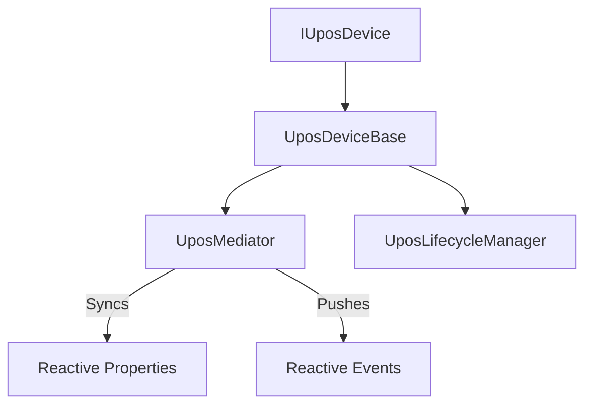

# PosSharp


[Documentation Index](docs/index.md) | [日本語ドキュメント](docs/index.jp.md) | [API Reference (Wiki)](https://github.com/w-red/PosSharp/wiki)

[](https://opensource.org/licenses/MIT)
[](https://dotnet.microsoft.com/download)
[](https://www.nuget.org/packages/PosSharp.Core/)
[](https://www.nuget.org/packages/PosSharp.Abstractions/)
[](https://github.com/w-red/PosSharp/actions/workflows/ci.yml)
[](https://github.com/w-red/PosSharp/actions/workflows/release.yml)


**PosSharp** is a platform-agnostic, reactive UPOS (Unified POS) framework for .NET. It provides a modern implementation of the UPOS standard, decoupling core POS logic from platform-specific SDK dependencies like the legacy POS for .NET (OPOS) or Windows-only components.

## 🚀 Key Features

- **Modern C# Implementation**: Fully utilizes C# 12+ features (Primary Constructors, etc.) and targets `.net10.0`. Supports older platforms via [PolySharp](https://github.com/Sergio0694/PolySharp).
- **Reactive State Management**: Built-in state synchronization using [R3](https://github.com/Cysharp/R3). Properties like `State`, `PowerState`, and `ResultCode` are exposed as reactive observables.
- **Mediator Architecture**: Centralized "Single Source of Truth" via the Mediator pattern, ensuring all properties (`DataCount`, `IsOpen`, etc.) stay perfectly in sync across asynchronous operations.
- **Task-Based Asynchronous API**: Modern asynchronous implementation of standard UPOS operations (`OpenAsync`, `ClaimAsync`, `SetEnabledAsync`).
- **Power Management**: Comprehensive support for power reporting and state notifications (`PowerNotify`) integrated directly into the base abstraction.
- **Zero Build Warnings**: Maintained at the highest quality with 100% XML documentation and strict static analysis.

## 📦 Packages

| Package | Description |
| ------- | ----------- |
| **PosSharp.Abstractions** | Core interfaces, enums, and event records. Perfect for client-side dependencies. |
| **PosSharp.Core** | The engine. Includes base classes, lifecycle management, and reactive mediator. |

### Installation

```bash
# To implement a device
dotnet add package PosSharp.Core

# For pure abstractions
dotnet add package PosSharp.Abstractions
```

## 🏗️ Architecture

PosSharp utilizes a sophisticated architecture to handle the complexity of the UPOS standard while maintaining clean, maintainable code.

### Mediator-Based State Management
Each device delegates its state and property management to a `UposMediator`. This ensures that when a device transitions (e.g., from `Idle` to `Enabled`), all related properties and reactive event streams are updated atomically.

### Flexible Lifecycle Management
Device transitions are governed by a `UposLifecycleManager`, allowing developers to implement custom lifecycle handlers or use the `StandardLifecycleHandler` for typical UPOS compliance.



## 🛠️ Usage

To create a new UPOS device, simply inherit from `UposDeviceBase`:

```csharp
using PosSharp.Abstractions;
using PosSharp.Core;

// Example implementation of a CashChanger
public class MyCashChanger : UposDeviceBase
{
    // Override required abstract members
    protected override Task OnOpenAsync(CancellationToken ct) => Task.CompletedTask;
    protected override Task OnCloseAsync(CancellationToken ct) => Task.CompletedTask;
    protected override Task OnClaimAsync(int timeout, CancellationToken ct) => Task.CompletedTask;
    protected override Task OnReleaseAsync(CancellationToken ct) => Task.CompletedTask;
    protected override Task OnEnableAsync(CancellationToken ct) => Task.CompletedTask;
    protected override Task OnDisableAsync(CancellationToken ct) => Task.CompletedTask;

    protected override Task<string> OnCheckHealthAsync(HealthCheckLevel level, CancellationToken ct)
    {
        return Task.FromResult("Internal:OK");
    }

    protected override Task OnDirectIOAsync(int command, int data, object obj, CancellationToken ct) => Task.CompletedTask;
    protected override Task OnClearInputAsync(CancellationToken ct) => Task.CompletedTask;
    protected override Task OnClearOutputAsync(CancellationToken ct) => Task.CompletedTask;
    
    // Use the protected helpers to update internal state
    public void SimulateCashAdded()
    {
        // DataCount is automatically synchronized via the Mediator
        UpdateDataCount(DataCount + 1);
    }
}
```

### Consuming a Device (Client-Side)

If you are just consuming a device (e.g., in a UI or business logic layer), you only need to depend on **PosSharp.Abstractions** and use the reactive interfaces:

```csharp
using PosSharp.Abstractions;
using R3;

public class DeviceMonitor(IUposDevice device)
{
    public void Initialize()
    {
        // React to state changes
        device.State
            .Subscribe(state => Console.WriteLine($"Device state: {state}"));

        // Handle data events
        device.DataEvents
            .Subscribe(e => Console.WriteLine($"Data received: {e.Status}"));
    }

    public async Task StartAsync()
    {
        await device.OpenAsync();
        await device.ClaimAsync(1000);
        await device.SetEnabledAsync(true);
    }
}
```

## 🧪 Testing

PosSharp is built with testability in mind. It includes a comprehensive test suite and provides stubs to help you test your own implementations.

```bash
dotnet test
```

## 📄 License

This project is licensed under the **MIT License**. See the [LICENSE](LICENSE) file for details.
