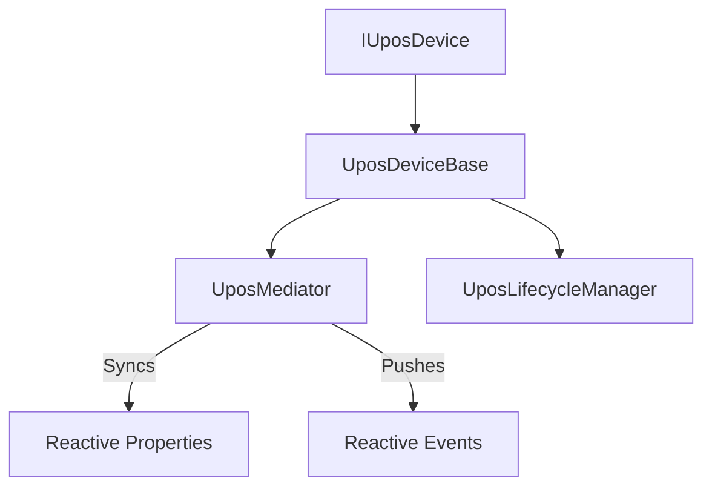

# PosSharp

[](https://opensource.org/licenses/MIT)
[](https://dotnet.microsoft.com/download)
[](https://github.com/w-red/PosSharp/actions/workflows/ci.yml)

**PosSharp** is a platform-agnostic, reactive UPOS (Unified POS) framework for .NET. It provides a modern implementation of the UPOS standard, decoupling core POS logic from platform-specific SDK dependencies like the legacy POS for .NET (OPOS).

## 🚀 Key Features

- **Platform-Agnostic Core**: Target `.net10.0` with support for older platforms via [PolySharp](https://github.com/Sergio0694/PolySharp). No dependency on legacy SDKs in the core library, with plans to support other .NET versions in the future.
- **Reactive State Management**: Built-in state synchronization using [R3](https://github.com/Cysharp/R3). Properties like `State`, `PowerState`, and `ResultCode` are exposed as reactive observables.
- **Mediator Architecture**: Centralized "Single Source of Truth" via the Mediator pattern, ensuring all properties (`DataCount`, `IsOpen`, etc.) stay perfectly in sync.
- **Modern Lifecycle**: Task-based asynchronous API for standard UPOS operations (`OpenAsync`, `ClaimAsync`, `SetEnabledAsync`).
- **Power Management**: Built-in support for power reporting and state notifications (`PowerNotify`), integrated directly into the base hardware abstraction.
- **High Testability**: Simplified testing with stubs and explicit state verification toggles.

## 🏗️ Architecture

PosSharp utilizes a sophisticated architecture to handle the complexity of the UPOS standard while maintaining clean, maintainable code.

### Mediator-Based State Management
Each device delegates its state and property management to a `UposMediator`. This ensures that when a device transitions (e.g., from `Idle` to `Enabled`), all related properties and reactive event streams are updated atomically.

### Flexible Lifecycle Management
Device transitions are governed by a `UposLifecycleManager`, allowing developers to implement custom lifecycle handlers or use the `StandardLifecycleHandler` for typical UPOS compliance.

### Responsibility Separation
PosSharp is designed with a strict separation between the framework and individual device implementations:
- **Framework (PosSharp.Core)**: Provides the UPOS compliant "template", state transition rules, and automatic power management notifications.
- **Device Implementation**: Inherits from the base class to provide concrete hardware logic, simulation behaviors, and device-specific members.



## 🛠️ Usage

To create a new UPOS device, simply inherit from `UposDeviceBase`:

```csharp
// Example implementation of a CashChanger
public class MyCashChanger : UposDeviceBase
{
    public MyCashChanger() : base() { }

    // Override required abstract members
    protected override Task OnOpenAsync(CancellationToken ct) => Task.CompletedTask;
    protected override Task OnClaimAsync(int timeout, CancellationToken ct) => Task.CompletedTask;
    protected override Task OnSetEnabledAsync(bool enabled, CancellationToken ct) => Task.CompletedTask;
    
    public override Task<UposCommandResult> CheckHealthAsync(HealthCheckLevel level)
    {
        return Task.FromResult(new UposCommandResult(UposErrorCode.Success));
    }
    
    // Use the protected helper to update internal state
    public void SimulateCashAdded()
    {
        UpdateDataCount(DataCount + 1);
    }
}
```

## 🧪 Testing

PosSharp comes with a comprehensive test suite using **Shouldly** and **xUnit**. 

```bash
dotnet test
```

We include granular compliance tests to ensure that all common UPOS properties and Power Management logic behave as expected according to the specification.

## 📄 License

This project is licensed under the **MIT License**. See the [LICENSE](LICENSE) file for details.
