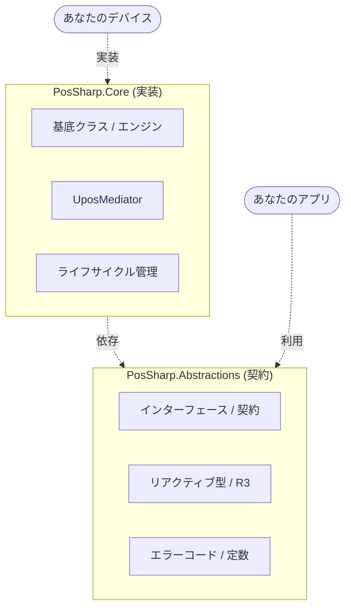

# PosSharp ドキュメントポータル

[日本語](index.jp.md) | [English](index.md)

**PosSharp** ドキュメントへようこそ。PosSharp は、プラットフォーム非依存でリアクティブな .NET 用 UPOS (Unified POS) フレームワークです。

## 🏗️ アーキテクチャ概要

PosSharp は、契約（Contracts）と実装（Implementations）が明確に分離された設計を採用しています。

## 🔗 クイックリンク

- **[API リファレンス (GitHub Wiki)](https://github.com/w-red/PosSharp/wiki)**: 全クラス・インターフェースの包括的な技術リファレンス。
- **[ドキュメント目次 (メインリポジトリ)](docs/index.jp.md)**: 各種マニュアル、移行ガイド、UPOS準拠性マトリクス。
- **[GitHub リポジトリ](https://github.com/w-red/PosSharp)**: ソースコード、問題報告、コミュニティ。
- **[NuGet パッケージ](https://www.nuget.org/packages?q=PosSharp)**: 最新の安定版リリース。

---

## ✨ 主な特徴

- **リアクティブな状態管理**: R3 をベースとした強力な状態同期機構。
- **プラットフォーム非依存**: 特定の SDK に依存しない純粋な C# 抽象化。
- **UPOS 規格準拠**: UnifiedPOS 仕様に忠実に設計。

詳細な移行ガイドや準拠性情報については、[ドキュメント目次](docs/index.jp.md) を参照してください。
