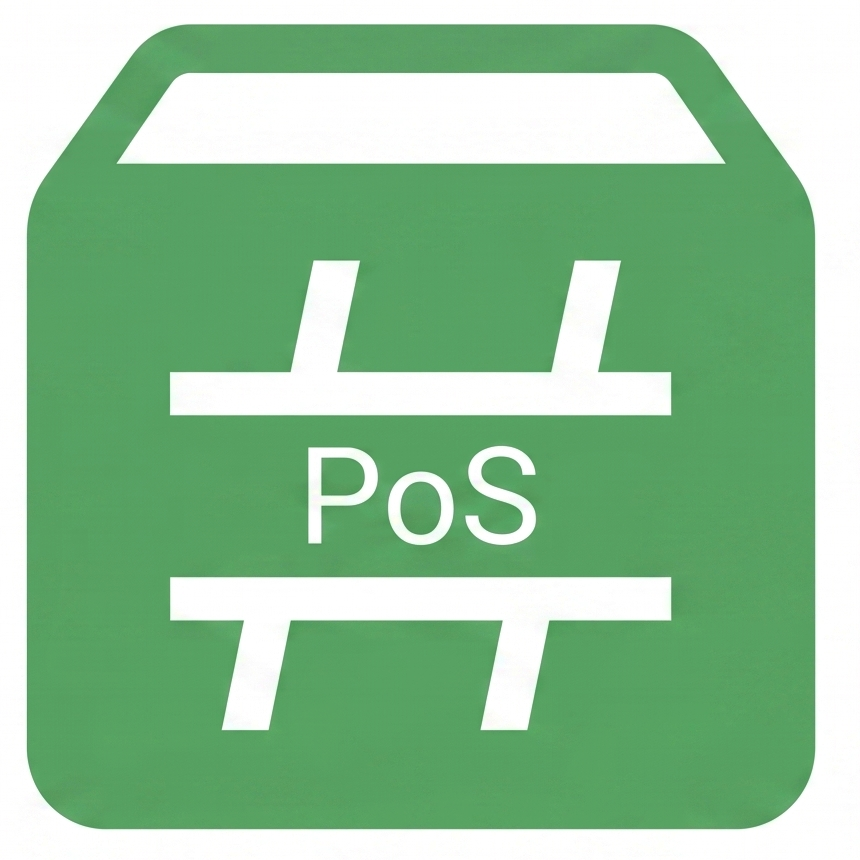
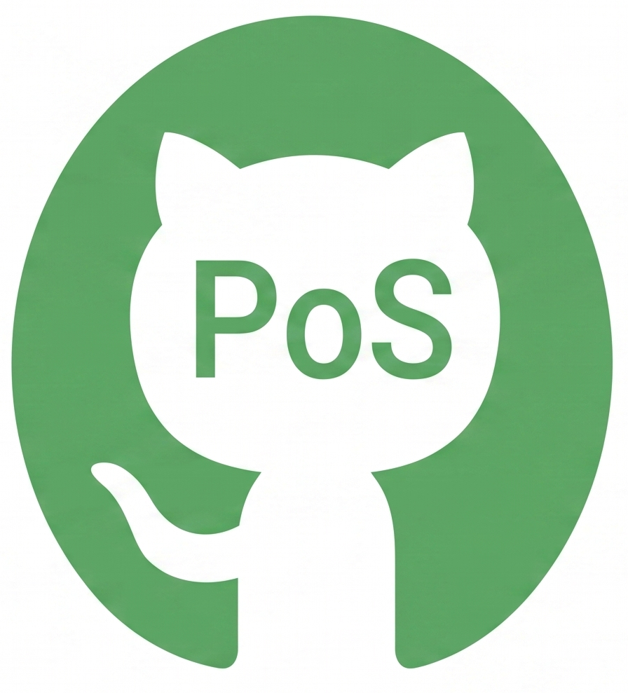

# PosSharp API Documentation

Welcome to the PosSharp API documentation. This library provides a modern, reactive, and platform-agnostic framework for UPOS (UnifiedPOS) device development in .NET.

## Quick Links

- **[🚀 Online Documentation (Coming Soon)](https://w-red.github.io/PosSharp/docs/reference/index.html)**: Interactive API reference and guides.
-  **NuGet**: Get the latest version.
-  **GitHub**: Source code and issues.
- **[API Reference](api/index.md)**: Explore the namespaces, classes, and interfaces.

---

## Key Features

- **Reactive State Management**: Built on top of R3 for powerful state synchronization.
- **Platform Agnostic**: Pure C# abstractions independent of specific SDKs.
- **UPOS Compliance**: Designed to follow the UnifiedPOS specification closely.

For detailed migration guides and compliance information, please refer to the original documentation in the `docs/` folder.
