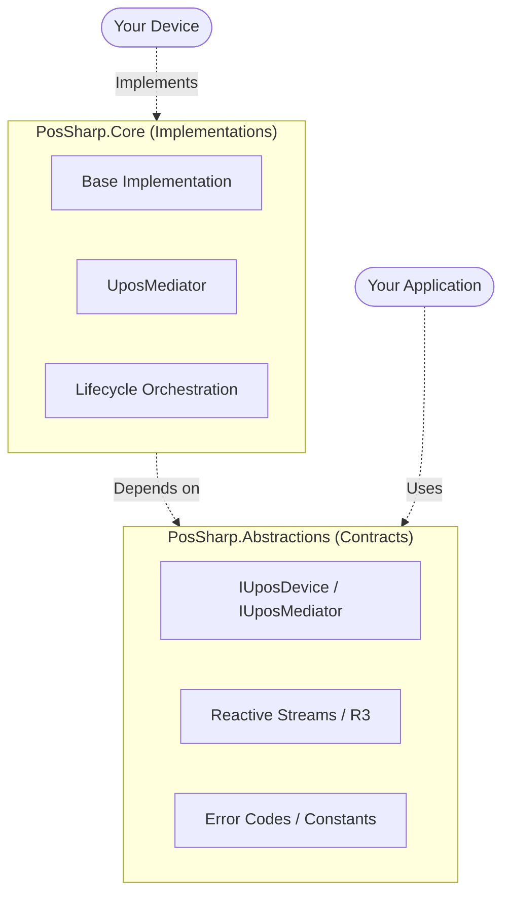

# PosSharp Documentation Portal

[English](index.md) | [日本語](index.jp.md)

Welcome to the **PosSharp** documentation. PosSharp is a platform-agnostic, reactive UPOS (Unified POS) framework for .NET.

## 🏗️ Architecture Overview

PosSharp is designed with a clear separation between contracts and implementations.

```mermaid
graph TD
    subgraph Core ["PosSharp.Core (Implementations)"]
        CoreLogic[Base Implementation]
        MediatorImpl[UposMediator]
        LifecycleLogic[Lifecycle Orchestration]
    end

    subgraph Abstractions ["PosSharp.Abstractions (Contracts)"]
        Interfaces[IUposDevice / IUposMediator]
        Reactive[Reactive Streams / R3]
        Enums[Error Codes / Constants]
    end

    %% Dependency relationship
    Core -.->|Depends on| Abstractions

    %% Usage Patterns
    App([Your Application]) -.->|Uses| Abstractions
    Dev([Your Device]) -.->|Implements| Core
```

## 🔗 Quick Links

- **[Full API Reference (GitHub Wiki)](https://github.com/w-red/PosSharp/wiki)**: Comprehensive technical reference for all classes and interfaces.
- **[Documentation Index (Main Repo)](docs/index.md)**: Manuals, migration guides, and compliance matrices.
- **[GitHub Repository](https://github.com/w-red/PosSharp)**: Source code, issue tracking, and contributions.
- **[NuGet Packages](https://www.nuget.org/packages?q=PosSharp)**: Latest stable releases.

---

## ✨ Key Features

- **Reactive State Management**: Built on top of R3 for powerful state synchronization.
- **Platform Agnostic**: Pure C# abstractions independent of specific SDKs.
- **UPOS Compliance**: Designed to follow the UnifiedPOS specification closely.

For detailed migration guides and compliance information, please refer to the [Documentation Index](docs/index.md).
